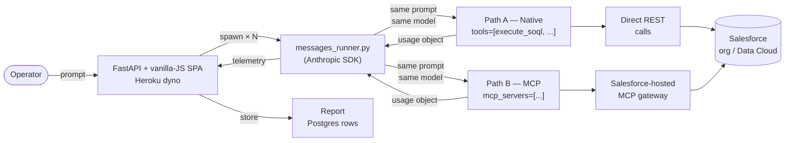
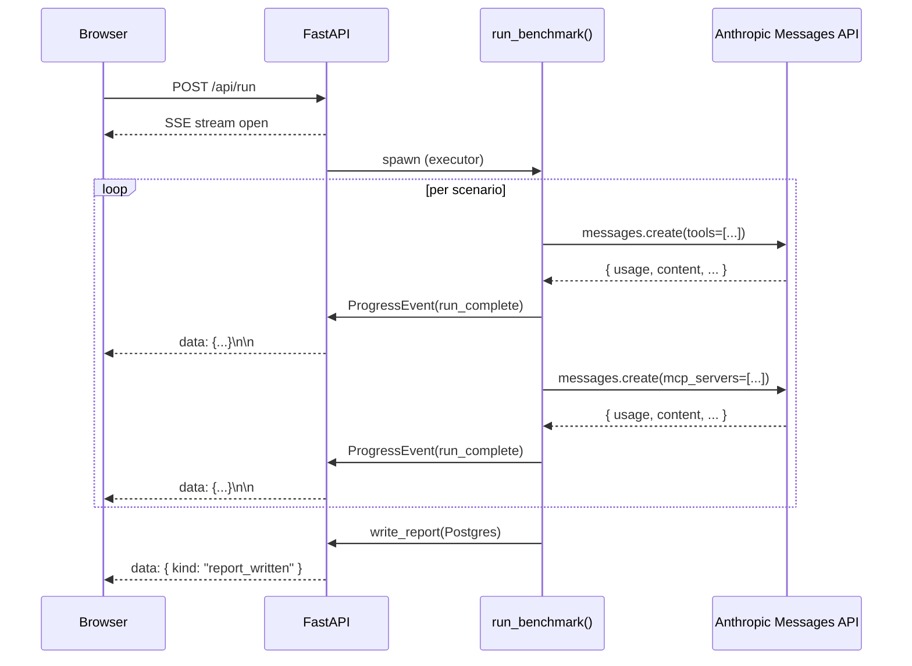

# Token Comparison Tool

> **Use it on Heroku**
>
> The hosted instance is at:
> <https://token-comparison-tool-cb60c8f1dcc3.herokuapp.com/>
>
> 1. Click **Connect Salesforce** to authorize via OAuth (the ECA's
>    callback list must include the Heroku URL — done by repo owner).
> 2. Pick a **model** from the dropdown — `claude-4-5-haiku` (cheap),
>    `claude-4-5-sonnet` (default), or `claude-opus-4-5` (premium).
> 3. Run the catalog, run a free-format prompt, or load a saved report.
>
> **Deploy your own**
>
> ```bash
> heroku create your-app-name
> heroku addons:create heroku-postgresql:essential-0 -a your-app-name
> heroku addons:create heroku-inference:claude-4-5-haiku  --as HEROKU_INFERENCE_TEAL   -a your-app-name
> heroku addons:create heroku-inference:claude-4-5-sonnet --as INFERENCE              -a your-app-name
> heroku addons:create heroku-inference:claude-opus-4-5   --as HEROKU_INFERENCE_COBALT -a your-app-name
> heroku config:set SESSION_SECRET=$(python3 -c 'import secrets;print(secrets.token_hex(32))') \
>                   SF_CLIENT_ID=... SF_CLIENT_SECRET=... \
>                   SF_LOGIN_URL=https://login.salesforce.com \
>                   SF_REDIRECT_URI=https://your-app-name.herokuapp.com/callback \
>                   -a your-app-name
> git push heroku main
> ```
>
> Add `https://your-app-name.herokuapp.com/callback` to your Salesforce
> ECA's callback URL list.

---

[](LICENSE)
[](https://www.python.org/downloads/)
[](https://fastapi.tiangolo.com/)
[](https://docs.pydantic.dev/)
[](#testing)
[](https://docs.claude.com/en/docs/claude-code)

A FastAPI + vanilla-JS web tool hosted on Heroku that benchmarks **token cost** between
two ways of invoking Salesforce operations from Claude:

- **Path A — Native:** `messages_runner.py` calls Salesforce APIs directly via REST calls
  (execute_soql, describe_object, list_sobjects, run_dc_query). No MCP servers loaded.
- **Path B — MCP:** `messages_runner.py` calls the Anthropic Messages API with `mcp_servers` parameter
  pointing at the Salesforce-hosted MCP gateway for server-side tool resolution.

Both paths run the same prompt against the same model and the same org via Heroku Inference.
The only axis of variance is the tool provider.

---

## Screenshots

### Catalog

The benchmark catalog. Below it (not shown in this older screenshot)
you'll find two more cards: a **Free-format scenario** card with its
own model / runs / max-turns controls, and a **Load saved report**
card with a dropdown of recent reports + a file upload. The list
itself has a column header row with **ID / Scenario / Scope /
Difficulty** labels and a tri-state master checkbox to select or
deselect every scenario at once.


### Scenario detail

Per-scenario verdict bar, hero metrics, custom HTML/CSS comparison chart,
editorial "Why these numbers differ" prose, and a turn-by-turn token
trace. Includes Export PDF + Download report at the bottom.


### Summary deck

Executive headline, three stat cards, cost-at-scale extrapolation,
per-scenario cost bars, and an auto-generated framework grid for "When
Native wins / When MCP wins".


> **Tip:** the green dot + wordmark in the top-left is a **home
> button** — click it any time to return to the catalog without losing
> in-progress work or loaded report state.

---

## Architecture

The two paths share everything except how Claude is given tools.



### Live progress over Server-Sent Events



### Three ways to put data on the screen

| Path | Endpoint | When to use |
|---|---|---|
| Run the catalog | `POST /api/run` | Full comparison across every scenario in `scenarios/` (the default benchmark) |
| Run a one-off prompt | `POST /api/run/freeform` | Ad-hoc question — each freeform scenario gets its own tab in the stepper with an indigo dot to distinguish it from catalog scenarios |
| View a past benchmark | `GET /api/reports/{name}/data` or `POST /api/reports/load` | Reload a past report (server-side or upload a file). Hydrates the same in-memory state a live run produces, so the verdict / trace / summary views all work identically |

All three end up in the same `_current_run["result_data"]` shape, so
the trace, summary, and PDF export endpoints serve them
identically — no special-case rendering paths.

---

## Features

- **Six-scenario catalog** — Sales Cloud SOQL through multi-DMO Customer
  360 joins. New scenarios are zero-code: drop a YAML file in
  `scenarios/`. The catalog table has a header row with column titles
  and a tri-state select-all checkbox so you can run a subset without
  clicking through every row.
- **Free-format mode** — write your own prompt in a textarea, pick
  Runs / Model / Max turns independently of the catalog, and run it
  through both paths. Each freeform scenario gets its own indigo-dot
  tab in the stepper that you can navigate into mid-run.
- **Load saved reports** — view any past benchmark in the same nice
  interface, even without re-running. Pick from a dropdown of the
  10 most recent reports, or upload an `.md` / `.json` report file
  from another machine. Works without Salesforce credentials —
  read-only viewing.
- **Live progress** — Server-Sent Events stream every run as it
  completes; UI updates in place. Polling fallback for when SSE drops.
- **Editorial summary** — auto-generated executive headline ("Native
  cost ~34% less per task..."), three stat cards, cost-at-scale
  extrapolation, "When Native wins / When MCP wins" framework grid.
- **Verdict bar** — per-scenario "Native came in at $0.022, MCP at
  $0.033 — 1.5× cheaper" headline with a delta-tokens callout.
- **Turn-by-turn trace** — token totals, cache breakdown, tool calls,
  and assistant replies side-by-side per turn.
- **Export** — markdown report download or full PDF (catalog page +
  every scenario + summary).
- **OAuth 2.1 + PKCE** — built-in browser-based Salesforce login flow.
  Tokens cached at `.cache/sf-token.json` (gitignored, 0o600).

## Prerequisites

| Dependency | How to verify |
|---|---|
| Python 3.11+ | `python3 --version` |
| Heroku CLI | `heroku --version`, `heroku auth:whoami` |
| A Salesforce ECA with `mcp_api`, `cdp_api`, `refresh_token` scopes and `https://<your-heroku-app>.herokuapp.com/callback` on its callback URL list | See `.env.example` |

## Project layout

```
.
├── README.md
├── LICENSE
├── pyproject.toml
├── requirements.txt           ← Heroku buildpack manifest
├── Procfile                   ← web: uvicorn token_compare.api:app ...
├── runtime.txt                ← python-3.11.10
├── app.json                   ← Heroku addon manifest
├── .env.example
├── config/
│   └── sf-mcp.json            ← upstream MCP server URLs
├── scenarios/                 ← scenario YAML catalog (s01–s06)
├── src/token_compare/
│   ├── api.py                 ← FastAPI app, SSE, OAuth callback, /api/models
│   ├── messages_runner.py     ← Anthropic Messages API tool-use loop
│   ├── benchmark.py           ← run_benchmark() orchestrator
│   ├── native_tools.py        ← REST-backed Native-path tools
│   ├── mcp_path.py            ← mcp_servers payload builder
│   ├── inference_client.py    ← Heroku Inference Anthropic client factory
│   ├── pricing.py             ← per-model token-price table
│   ├── db.py                  ← Postgres pool + sessions/reports/runs/audit DAOs
│   ├── sessions.py            ← signed-cookie session id helpers
│   ├── sf_auth.py             ← OAuth 2.1 + PKCE
│   ├── legacy_parser.py       ← parse_claude_json for old report uploads
│   ├── analysis.py            ← trace + executive summary
│   ├── report.py              ← markdown writer
│   ├── report_loader.py       ← reverse parser (.md / .json → BenchmarkResult)
│   ├── recommendations.py
│   ├── scenarios.py
│   ├── preflight.py
│   └── models.py              ← Pydantic types
├── static/                    ← single-page app
│   ├── index.html             ← catalog + freeform + load-report cards
│   ├── styles.css
│   ├── app.js                 ← SPA controller
│   └── chart.min.js
├── docs/
│   ├── superpowers/specs/     ← original local-tool spec + heroku-port spec
│   └── superpowers/plans/     ← original local-tool plan + heroku-port plan
├── reports/                   ← legacy on-disk reports (pre-Heroku); .gitignored
└── tests/                     ← pytest suite (~80 tests)
```

## Adding a scenario

Drop a YAML file in `scenarios/`. The runner picks it up automatically:

```yaml
id: s07_my_new_scenario
title: "Top 10 leads by lead score"
category: core-crm
difficulty: medium
prompt: |
  In Salesforce, list the top 10 Leads by LeadScore descending.
  Return Name, Company, and LeadScore.
expected_operations:
  - "Native: sf data query Lead"
  - "MCP: mcp__salesforce_crm__soqlQuery"
success_criteria:
  must_contain: ["LeadScore"]
notes: |
  Tests SOQL ORDER BY on a custom numeric field.
```

## How it works under the hood

1. **One runner, two tool surfaces.** `messages_runner.py` calls `anthropic.messages.create(...)` against Heroku Inference. Native path passes `tools=NATIVE_TOOL_DEFS` and dispatches each tool_use block to direct REST calls (`execute_soql` etc). MCP path passes `mcp_servers=[...]` and lets the Inference connector resolve tools server-side. Same prompt, same model, same `--max-turns` cap. Path order is still randomized per scenario.
2. **Telemetry is the SDK `usage` object.** Each `messages.create()` returns `usage.input_tokens`, `output_tokens`, `cache_read_input_tokens`, `cache_creation_input_tokens`. The runner aggregates across turns (the same way the legacy `modelUsage` aggregate worked) and computes cost from a per-1M-token price table in `pricing.py`.
3. **Backups and retries.** On `anthropic.APIError` / `RateLimitError` the runner retries once (honoring `Retry-After`); after that the run is recorded as a failed `RunResult` with the error message and the rest of the benchmark continues. Max-turns and the new MCP-unresolved-tool-use signals also map cleanly into the existing failure semantics.
4. **Reports live in Postgres.** Each completed benchmark gets a `reports` row keyed by an opaque `rpt_<hex>` id; per-turn `runs` rows stream in as the SSE updates. The 10 most recent reports are listed in the catalog UI.
5. **Loading old reports.** The "Load saved report" card reads from the `reports` table on the dyno. JSON uploads still work for cross-deploy portability — they hit the same legacy `parse_claude_json` path so reports written by the original local tool can still be viewed.

## HTTP API reference

The frontend talks to these endpoints. They're also useful if you
want to script the tool from the command line.

| Method | Path | Purpose |
|---|---|---|
| `GET` | `/api/preflight` | Verify Heroku Inference, Postgres, and Salesforce OAuth are ready |
| `GET` | `/api/models` | Return the 3 Inference model_ids (haiku, sonnet, opus) |
| `GET` | `/api/scenarios` | Return the scenario catalog (from `scenarios/*.yaml`) |
| `POST` | `/api/run` | Start a catalog benchmark; streams SSE events for live progress |
| `POST` | `/api/run/freeform` | Start a one-off benchmark with a custom prompt; streams SSE events |
| `GET` | `/api/run/status` | Polling fallback for SSE — current state + accumulated events |
| `GET` | `/api/reports` | List the 10 most recent reports from Postgres |
| `GET` | `/api/reports/{report_id}/data` | Load a specific report by opaque `rpt_<hex>` id |
| `GET` | `/api/reports/{report_id}/summary` | Auto-generated executive summary for the report |
| `POST` | `/api/reports/load` | Multipart upload an `.md` or `.json` report and load it |
| `GET` | `/api/scenarios/{id}/trace` | Turn-by-turn trace + explanation paragraph for the most recently loaded benchmark's scenario |
| `POST` | `/api/sf/login` | Trigger the OAuth 2.1 + PKCE browser flow; blocks until callback |
| `POST` | `/api/sf/logout` | Clear the cached access token |
| `GET` | `/callback` | OAuth redirect URI handler (Heroku URL) |

## Testing

```bash
.venv/bin/python -m pytest tests/ -q
```

80 passing, 5 skipped (`test_db.py` opt-in via `TEST_DATABASE_URL`; one path-traversal test made obsolete by opaque DB-generated report ids). The skipped DB tests are exercised end-to-end on Heroku via `migrate()` running on dyno startup.

## Security & privacy

- `.env.local` still works for local dev only. **Never commit your real `SF_CLIENT_ID` /
  `SF_CLIENT_SECRET`.**
- SF tokens now live in the Heroku Postgres `sessions` table, keyed by an HTTP-only signed cookie (no more `.cache/sf-token.json`).
- The SESSION_SECRET signs the cookie HMAC; rotate it via `heroku config:set SESSION_SECRET=...` if compromised (which logs everyone out).
- Reports rows in the `reports` table contain prompts, token counts, and possibly customer data from your org — same gitignore-on-the-old-disk concern, now a "treat your Heroku Postgres as production data" concern.
- The frontend never uses `innerHTML` with interpolated data. All DOM
  construction goes through `document.createElement` + `textContent` /
  attribute setters to avoid XSS even in trace output.

## Design spec

- Original local-tool RFC: [`docs/superpowers/specs/2026-05-04-token-comparison-tool-design.md`](docs/superpowers/specs/2026-05-04-token-comparison-tool-design.md) (historical)
- Original local-tool implementation plan: [`docs/superpowers/plans/2026-05-04-token-comparison-tool.md`](docs/superpowers/plans/2026-05-04-token-comparison-tool.md) (historical)
- Heroku port design: [`docs/superpowers/specs/2026-05-07-heroku-port-design.md`](docs/superpowers/specs/2026-05-07-heroku-port-design.md)
- Heroku port implementation plan: [`docs/superpowers/plans/2026-05-07-heroku-port.md`](docs/superpowers/plans/2026-05-07-heroku-port.md)

## License

[MIT](LICENSE)
