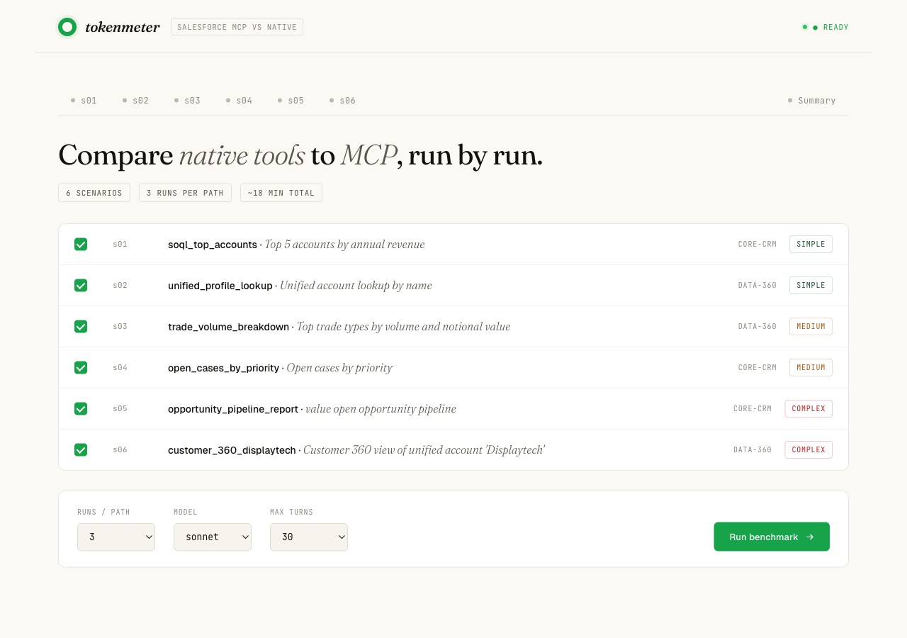
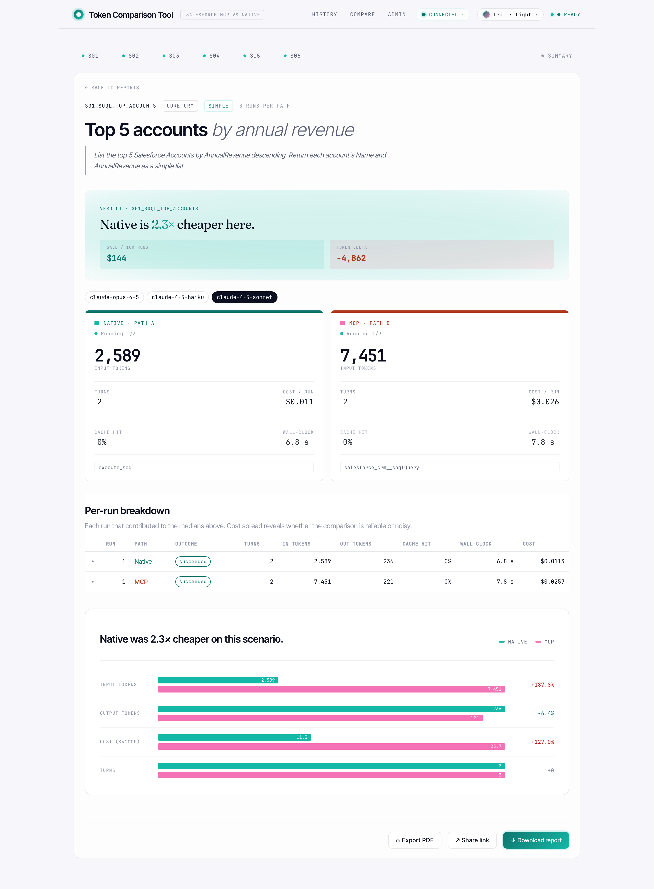
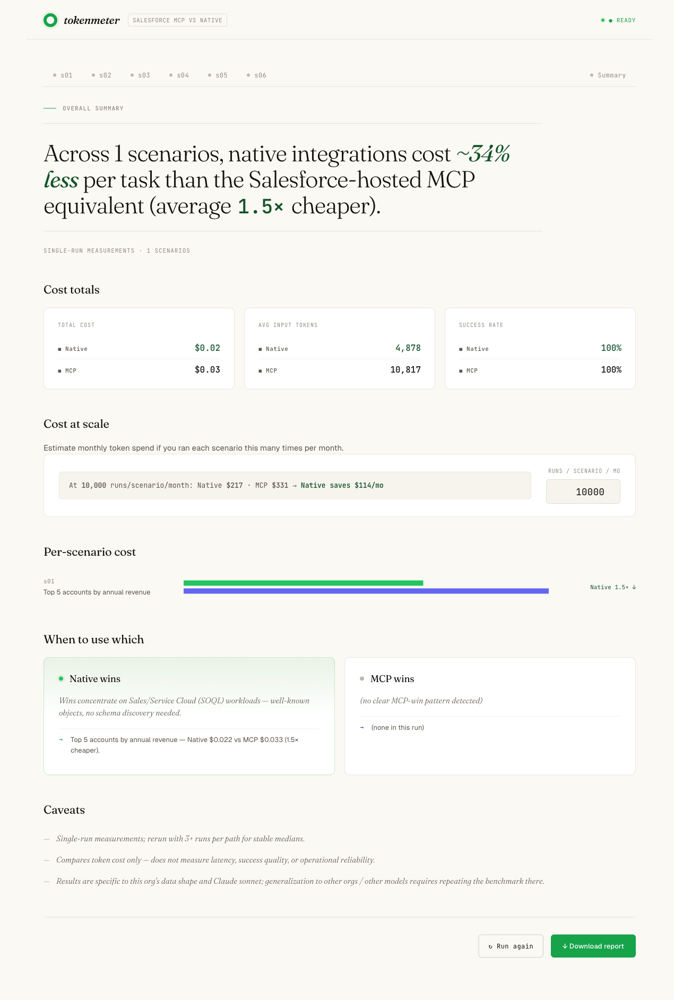
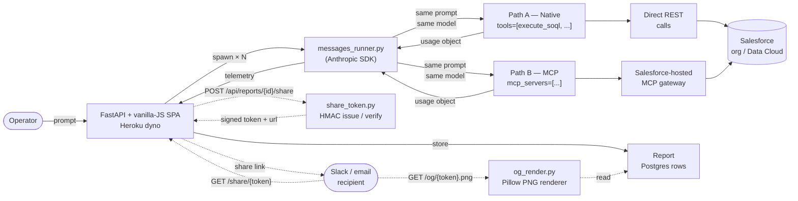
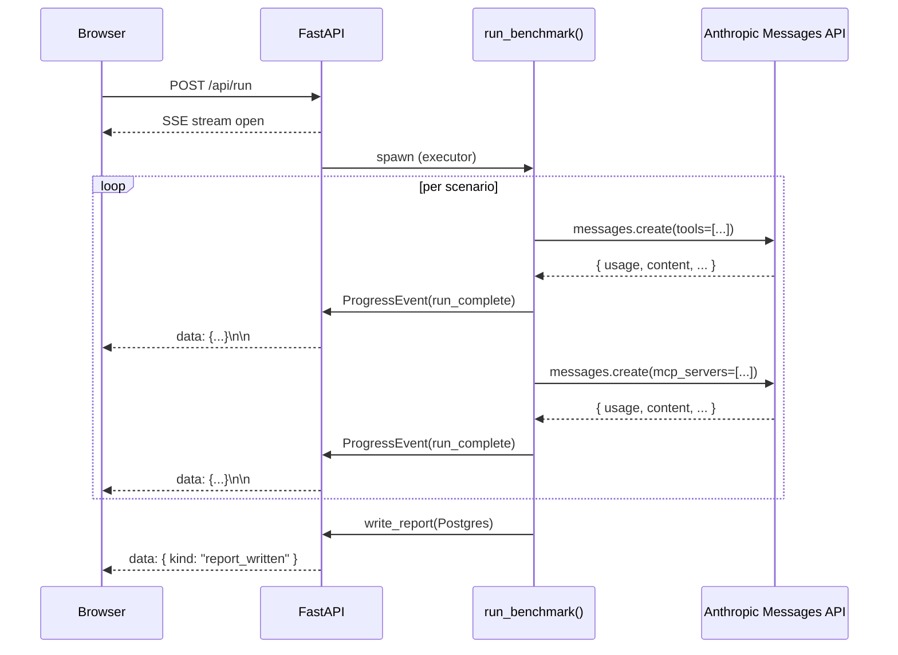

# Token Comparison Tool

> **Use it on Heroku**
>
> The hosted instance is at:
> <https://token-comparison-tool-cb60c8f1dcc3.herokuapp.com/>
>
> 1. Click **Connect Salesforce** to authorize via OAuth (the ECA's
>    callback list must include the Heroku URL — done by repo owner).
> 2. Pick a **model** from the dropdown — `claude-4-5-haiku` (cheap),
>    `claude-4-5-sonnet` (default), or `claude-opus-4-5` (premium).
> 3. Run the catalog, run a free-format prompt, or load a saved report.
>
> **Deploy your own**
>
> ```bash
> heroku create your-app-name
> heroku addons:create heroku-postgresql:essential-0 -a your-app-name
> heroku addons:create heroku-inference:claude-4-5-haiku  --as HEROKU_INFERENCE_TEAL   -a your-app-name
> heroku addons:create heroku-inference:claude-4-5-sonnet --as INFERENCE              -a your-app-name
> heroku addons:create heroku-inference:claude-opus-4-5   --as HEROKU_INFERENCE_COBALT -a your-app-name
> heroku config:set SESSION_SECRET=$(python3 -c 'import secrets;print(secrets.token_hex(32))') \
>                   SF_CLIENT_ID=... SF_CLIENT_SECRET=... \
>                   SF_LOGIN_URL=https://login.salesforce.com \
>                   SF_REDIRECT_URI=https://your-app-name.herokuapp.com/callback \
>                   -a your-app-name
> git push heroku main
> ```
>
> Add `https://your-app-name.herokuapp.com/callback` to your Salesforce
> ECA's callback URL list.

---

[](LICENSE)
[](https://www.python.org/downloads/)
[](https://fastapi.tiangolo.com/)
[](https://docs.pydantic.dev/)
[](#testing)
[](https://docs.claude.com/en/docs/claude-code)

A FastAPI + vanilla-JS web tool hosted on Heroku that benchmarks **token cost** between
two ways of invoking Salesforce operations from Claude:

- **Path A — Native:** `messages_runner.py` calls Salesforce APIs directly via REST calls
  (execute_soql, describe_object, list_sobjects, run_dc_query). No MCP servers loaded.
- **Path B — MCP:** `messages_runner.py` calls the Anthropic Messages API with `mcp_servers` parameter
  pointing at the Salesforce-hosted MCP gateway for server-side tool resolution.

Both paths run the same prompt against the same model and the same org via Heroku Inference.
The only axis of variance is the tool provider.

---

## Screenshots

> Captured against the live Heroku deployment via
> [`scripts/capture_screenshots.py`](scripts/capture_screenshots.py)
> (Playwright headless Chromium, 1440×900 viewport, retina,
> `Teal · Light` theme). Re-run any time the UI shifts.

### Catalog (home)

A **scenario card grid** — each card has a category dot, scenario id +
title, difficulty pill, and a tiny sparkline of recent Native vs MCP cost
trends pulled from `/api/scenarios/sparkline`. A tri-state "Select all"
checkbox up top toggles every card; cards have a hover lift and selected
cards get a palette-tinted glow ring. A sticky controls panel below holds
runs / model / max-turns selectors and the **Run benchmark** primary CTA.



### Scenario detail

A **cinematic verdict hero** at the top: editorial Fraunces headline
("Native is **1.5×** cheaper here.") with the multiplier as gradient text,
animated counter on first reveal, and two callouts (savings @ 10k runs,
token delta). Below: 4 sparkline KPI cards (Cost trend, Cache hit, Success,
p95 wall-clock) coloured with the active palette's Native/MCP gradients,
the dual Native / MCP glass panels, the comparison chart, the editorial
"Why these numbers differ" prose, and an interactive turn-by-turn trace.



### Summary deck

Cinematic Fraunces headline, glass cost-totals cards with palette-accent
stripes, an **interactive log-scale cost-forecast slider** (10 → 1M
runs/month) that drives `/api/reports/{id}/projection` over rAF + 300 ms
debounce, glass projection KPIs, per-scenario gradient bars, the
"When Native wins / When MCP wins" framework grid, run-outcomes stacked
bars, cache-effectiveness tiles, and caveats with amber `!` markers.



> **Tip:** the gradient dot + wordmark in the top-left is a **home
> button** — click it any time to return to the catalog without losing
> in-progress work or loaded report state.

### Header chrome (every page)

The header carries three controls beyond navigation:

- **Theme puck** — labelled pill (e.g. `Teal · Light`) that opens a
  dropdown with a Light/Dark segmented control, four palette tiles
  (Teal+Coral, Emerald+Violet, Cyan+Amber, Forest+Terracotta), and a
  "Match system color scheme" toggle. Persists to `localStorage` and a
  cookie so it survives reloads and reaches server-rendered surfaces
  (PDF export, OG cards). FOUC-blocked via an inline `<head>` pre-paint
  script.
- **Auth chip** — pill with a status dot showing `Sign in` / `Checking…`
  / `Connected`. Click opens a dropdown with the org host and a primary
  **Connect Salesforce →** or secondary **Sign out** button. Polls
  `/api/sf/status` on load, every 30 s, and on window focus.
- **Preflight status** — `READY` / failure summary derived from
  `/api/preflight` (Heroku Inference, Postgres, Salesforce OAuth).

---

## Architecture

The two paths share everything except how Claude is given tools.



### Live progress over Server-Sent Events



### Five ways to put data on the screen

| Path | Endpoint | When to use |
|---|---|---|
| Run the catalog | `POST /api/run` | Full comparison across every scenario in `scenarios/` (the default benchmark) |
| Run a one-off prompt | `POST /api/run/freeform` | Ad-hoc question — each freeform scenario gets its own tab in the stepper with an indigo dot to distinguish it from catalog scenarios |
| View a past benchmark | `GET /api/reports/{name}/data` or `POST /api/reports/load` | Reload a past report (server-side or upload a file). Hydrates the same in-memory state a live run produces, so the verdict / trace / summary views all work identically |
| Share a read-only view | `POST /api/reports/{id}/share` → `GET /share/{token}` | Issues an HMAC-signed share token (default 30-day TTL). Recipient sees the same scenario / summary views in guest mode (`window.__SHARE_GUEST__`) without needing Salesforce credentials |
| Compare two reports | `GET /compare?a=<id>&b=<id>` (or pick rows in the Reports table) | `compare.py` diffs two cube-shaped payloads, surfaces regressions first |

All in-app routes funnel into the same `_current_run["result_data"]`
shape, so trace, summary, and PDF export serve them identically — no
special-case rendering paths. Share endpoints mirror the in-app endpoints
under `/api/share/<token>/...` so the SPA reuses one set of fetchers.

---

## Features

### Benchmarking

- **Six-scenario catalog** — Sales Cloud SOQL through multi-DMO Customer
  360 joins. New scenarios are zero-code: drop a YAML file in
  `scenarios/`. The catalog renders as a card grid with category dots,
  difficulty pills, and a tri-state select-all toggle.
- **Free-format mode** — write your own prompt in a textarea, pick
  Runs / Model / Max turns independently of the catalog, and run it
  through both paths. Each freeform scenario gets its own indigo-dot
  tab in the stepper that you can navigate into mid-run.
- **Load saved reports** — view any past benchmark in the same nice
  interface, even without re-running. Pick from a dropdown of the
  10 most recent reports, or upload an `.md` / `.json` report file
  from another machine. Works without Salesforce credentials —
  read-only viewing.
- **Live progress** — Server-Sent Events stream every run as it
  completes; UI updates in place. Polling fallback for when SSE drops.

### Analysis

- **Cinematic verdict hero** — per-scenario Fraunces headline with a
  gradient-text multiplier, animated counter on first reveal, and two
  callouts (10k-run savings, token delta).
- **Turn-by-turn trace** — token totals, cache breakdown, tool calls,
  and assistant replies side-by-side per turn.
- **Editorial summary deck** — auto-generated headline, glass cost-totals
  cards, "When Native wins / When MCP wins" framework grid, run-outcomes
  bars, cache-effectiveness tiles, caveats list.
- **Interactive cost-forecast slider** (Tier E F3) — log-scale
  10 → 1,000,000 monthly runs, drives `/api/reports/{id}/projection`
  with rAF + 300 ms debounce. Annotated ticks at 10/100/1k/10k/100k/1M.
- **Per-scenario sparklines** (Tier E F4) — trends pulled from
  `/api/scenarios/sparkline` and lazy-rendered onto the catalog cards.

### Theme system (Tier E F1)

- **8 looks** — 4 palettes (Teal+Coral, Emerald+Violet, Cyan+Amber,
  Forest+Terracotta) × Light + Dark.
- **Header puck** — labelled pill with a Light/Dark segmented control,
  4 palette tiles, and a "Match system" toggle.
- **Persistence** — `localStorage` + `tokenmeter_theme` cookie (so
  server-rendered surfaces like the PDF export and OG cards see the
  active theme).
- **No FOUC** — inline `<head>` pre-paint script applies the theme
  before first paint.
- **Reduced motion** — `prefers-reduced-motion` flattens animations,
  counters jump to final value, glows render static; theme-switch
  cross-fade stays for comprehension.

### Sharing & comparison

- **Share links (Tier D)** — `POST /api/reports/{id}/share` mints an
  HMAC-signed token; `/share/{token}` is the read-only guest-mode URL.
  Default 30-day TTL, configurable per-issue.
- **OpenGraph cards (Tier E F5)** — `GET /og/{token}.png` renders a
  1200×630 PNG via Pillow showing the verdict + Native/MCP medians.
  Theme + palette respected via query string. Cached in-memory (LRU,
  200 entries) so the second unfurl serves instantly.
- **Cube-vs-cube compare (Tier D)** — `/compare` diffs two reports,
  surfaces regressions first, highlights scope changes (added /
  removed scenarios).
- **Reports analytics & history** — sortable tables, KPIs across
  all benchmarks, per-scenario history walker (`/api/history`).

### Auth & ops

- **OAuth 2.1 + PKCE** — built-in browser-based Salesforce login flow.
  Tokens stored in the Heroku Postgres `sessions` table, keyed by an
  HTTP-only signed session cookie. No filesystem token cache.
- **Header auth chip** — pill with `Sign in` / `Checking…` / `Connected`
  states. Click opens a dropdown with org host + login/logout button.
  Polls `/api/sf/status` on load, every 30 s, and on focus.
- **Export** — markdown report download or full PDF (catalog page +
  every scenario + summary). PDF uses a print stylesheet that flattens
  glows + animations and forces light mode regardless of theme.

## Prerequisites

| Dependency | How to verify |
|---|---|
| Python 3.11+ | `python3 --version` |
| Heroku CLI | `heroku --version`, `heroku auth:whoami` |
| A Salesforce ECA with `mcp_api`, `cdp_api`, `refresh_token` scopes and `https://<your-heroku-app>.herokuapp.com/callback` on its callback URL list | See `.env.example` |

## Project layout

```
.
├── README.md
├── LICENSE
├── pyproject.toml
├── requirements.txt           ← Heroku buildpack manifest (incl. Pillow)
├── Procfile                   ← web: uvicorn token_compare.api:app ...
├── runtime.txt                ← python-3.11.10
├── app.json                   ← Heroku addon manifest
├── .env.example
├── config/
│   ├── README.md
│   └── sf-mcp.json            ← upstream MCP server URLs
├── scenarios/                 ← scenario YAML catalog (s01–s06)
├── src/token_compare/
│   ├── api.py                 ← FastAPI app, SSE, OAuth, share + OG endpoints
│   ├── messages_runner.py     ← Anthropic Messages API tool-use loop
│   ├── benchmark.py           ← run_benchmark() orchestrator
│   ├── native_tools.py        ← REST-backed Native-path tools
│   ├── mcp_path.py            ← mcp_servers payload builder
│   ├── inference_client.py    ← Heroku Inference Anthropic client factory
│   ├── pricing.py             ← per-model token-price table
│   ├── projection.py          ← cost-at-scale projection math (Tier B)
│   ├── compare.py             ← cube-vs-cube diff with regression flagging (Tier D)
│   ├── share_token.py         ← HMAC issue / verify for /share links (Tier D)
│   ├── og_render.py           ← Pillow OG card renderer (Tier E F5)
│   ├── diff_explainer.py      ← per-turn trace diff helper
│   ├── db.py                  ← Postgres pool + sessions/reports/runs DAOs
│   ├── sessions.py            ← signed-cookie session id helpers
│   ├── sf_auth.py             ← OAuth 2.1 + PKCE
│   ├── legacy_parser.py       ← parse_claude_json for old report uploads
│   ├── analysis.py            ← trace + executive summary
│   ├── report.py              ← markdown writer
│   ├── report_loader.py       ← reverse parser (.md / .json → BenchmarkResult)
│   ├── recommendations.py
│   ├── scenarios.py
│   ├── preflight.py
│   └── models.py              ← Pydantic types
├── static/                    ← single-page app
│   ├── index.html             ← catalog + landing + setup + scenario + summary
│   ├── share.html             ← guest-mode read-only view
│   ├── compare.html           ← /compare two-report diff page
│   ├── history.html           ← per-scenario / per-model history walker
│   ├── admin.html             ← scenario CRUD admin
│   ├── styles.css             ← entry shim — @imports the CSS modules below
│   ├── css/
│   │   ├── tokens.css         ← 8 theme looks (4 palettes × light/dark)
│   │   ├── base.css           ← header, container, buttons, glass card, pills
│   │   ├── motion.css         ← keyframes + reduced-motion fallbacks
│   │   ├── views.css          ← per-view styles (catalog cards, verdict hero, ...)
│   │   ├── themepuck.css      ← header theme selector
│   │   ├── authchip.css       ← header SF login chip
│   │   ├── overrides.css      ← Spatial Glass typography overrides on legacy
│   │   ├── summary.css        ← Spatial Glass treatment for #summary-view
│   │   ├── legacy.css         ← original component styles, theme-aware shim
│   │   └── print.css          ← @media print — flatten animations + glows
│   ├── js/
│   │   ├── theme.js           ← applyTheme/getTheme/subscribe + persistence
│   │   ├── themepuck.js       ← header theme selector dropdown
│   │   ├── authchip.js        ← header SF login chip
│   │   └── motion.js          ← animateCounter + revealOnScroll helpers
│   ├── fonts/                 ← self-hosted Fraunces + JetBrains Mono
│   ├── app.js                 ← SPA controller
│   ├── compare.js             ← /compare page controller
│   ├── history.js             ← /history page controller
│   └── chart.min.js
├── CHANGELOG.md               ← tier-by-tier release notes
├── docs/
│   └── screenshots/           ← README screenshots (Spatial Glass)
├── reports/                   ← legacy on-disk reports (pre-Heroku); .gitignored
└── tests/                     ← pytest suite (190 passing, 5 skipped)
```

## Adding a scenario

Drop a YAML file in `scenarios/`. The runner picks it up automatically:

```yaml
id: s07_my_new_scenario
title: "Top 10 leads by lead score"
category: core-crm
difficulty: medium
prompt: |
  In Salesforce, list the top 10 Leads by LeadScore descending.
  Return Name, Company, and LeadScore.
expected_operations:
  - "Native: sf data query Lead"
  - "MCP: mcp__salesforce_crm__soqlQuery"
success_criteria:
  must_contain: ["LeadScore"]
notes: |
  Tests SOQL ORDER BY on a custom numeric field.
```

## How it works under the hood

1. **One runner, two tool surfaces.** `messages_runner.py` calls `anthropic.messages.create(...)` against Heroku Inference. Native path passes `tools=NATIVE_TOOL_DEFS` and dispatches each tool_use block to direct REST calls (`execute_soql` etc). MCP path passes `mcp_servers=[...]` and lets the Inference connector resolve tools server-side. Same prompt, same model, same `--max-turns` cap. Path order is still randomized per scenario.
2. **Telemetry is the SDK `usage` object.** Each `messages.create()` returns `usage.input_tokens`, `output_tokens`, `cache_read_input_tokens`, `cache_creation_input_tokens`. The runner aggregates across turns (the same way the legacy `modelUsage` aggregate worked) and computes cost from a per-1M-token price table in `pricing.py`.
3. **Backups and retries.** On `anthropic.APIError` / `RateLimitError` the runner retries once (honoring `Retry-After`); after that the run is recorded as a failed `RunResult` with the error message and the rest of the benchmark continues. Max-turns and the new MCP-unresolved-tool-use signals also map cleanly into the existing failure semantics.
4. **Reports live in Postgres.** Each completed benchmark gets a `reports` row keyed by an opaque `rpt_<hex>` id; per-turn `runs` rows stream in as the SSE updates. The 10 most recent reports are listed in the catalog UI.
5. **Loading old reports.** The "Load saved report" card reads from the `reports` table on the dyno. JSON uploads still work for cross-deploy portability — they hit the same legacy `parse_claude_json` path so reports written by the original local tool can still be viewed.

## HTTP API reference

The frontend talks to these endpoints. They're also useful if you want
to script the tool from the command line.

### Preflight + capabilities

| Method | Path | Purpose |
|---|---|---|
| `GET` | `/api/preflight` | Verify Heroku Inference, Postgres, and Salesforce OAuth are ready |
| `GET` | `/api/models` | Return the 3 Inference model_ids (haiku, sonnet, opus) |
| `GET` | `/api/scenarios` | Return the scenario catalog (from `scenarios/*.yaml`) |
| `GET` | `/api/scenarios/sparkline?ids=s01,s02,...` | Per-scenario Native/MCP cost trends from the last 20 reports (Tier E) |

### Salesforce auth

| Method | Path | Purpose |
|---|---|---|
| `GET` | `/api/sf/status` | `{logged_in: bool, instance_url?: str}` — drives the header auth chip |
| `POST` | `/api/sf/login` | Trigger the OAuth 2.1 + PKCE browser flow; blocks until callback |
| `POST` | `/api/sf/logout` | Clear the cached access token |
| `GET` | `/callback` | OAuth redirect URI handler |

### Running benchmarks

| Method | Path | Purpose |
|---|---|---|
| `POST` | `/api/run` | Start a catalog benchmark; streams SSE events for live progress |
| `POST` | `/api/run/freeform` | Start a one-off benchmark with a custom prompt; streams SSE events |
| `GET` | `/api/run/status` | Polling fallback for SSE — current state + accumulated events |

### Reports

| Method | Path | Purpose |
|---|---|---|
| `GET` | `/api/reports` | List most recent reports from Postgres (sortable, filterable client-side) |
| `GET` | `/api/reports/latest/data` | Latest finalized report's full payload |
| `GET` | `/api/reports/latest/summary` | Latest finalized report's executive summary |
| `GET` | `/api/reports/{report_id}/data` | Load a specific report by opaque `rpt_<hex>` id |
| `GET` | `/api/reports/{report_id}/markdown` | Markdown export of a specific report |
| `GET` | `/api/reports/{report_id}/projection` | Cost-at-scale projection (Tier B); accepts `volume`, `period`, `growth_rate_pct`, `thresholds`, `model` |
| `GET` | `/api/reports/compare?a=<id>&b=<id>` | Cube-vs-cube diff with regression heuristic (Tier D) |
| `GET` | `/api/scenarios/{id}/trace` | Turn-by-turn trace + explanation for the most-recently-loaded scenario |
| `GET` | `/api/history?scenario_id=...&model=...&metric=cost\|cache\|success\|p95_duration` | Per-scenario history walker — drives the 4 sparkline KPI cards |
| `POST` | `/api/reports/load` | Multipart upload an `.md` or `.json` report and load it |

### Sharing & OG (Tier D + Tier E F5)

| Method | Path | Purpose |
|---|---|---|
| `POST` | `/api/reports/{report_id}/share` | Mint an HMAC-signed share token; returns `{token, url, expires_at}` |
| `GET` | `/share/{token}` | Pretty redirect to `/share.html?token=...` |
| `GET` | `/api/share/{token}/data` | Read-only mirror of `/api/reports/{id}/data` |
| `GET` | `/api/share/{token}/projection` | Read-only mirror of the projection endpoint |
| `GET` | `/api/share/{token}/scenarios/{scenario_id}/trace` | Read-only mirror of the trace endpoint |
| `GET` | `/og/{token}.png?theme=light&palette=teal-coral` | Server-rendered 1200×630 OG card (Pillow); cached in-memory |

### Admin (Salesforce-authenticated)

| Method | Path | Purpose |
|---|---|---|
| `GET` | `/api/admin/scenarios` | List scenarios for the admin UI |
| `POST` | `/api/admin/scenarios` | Create or update a scenario |
| `POST` | `/api/admin/scenarios/{id}/restore` | Restore a soft-deleted scenario |

### Page redirects (HTML entry points)

| Method | Path | Purpose |
|---|---|---|
| `GET` | `/` | Main SPA — `static/index.html` |
| `GET` | `/admin` | 307 → `/admin.html` |
| `GET` | `/history` | 307 → `/history.html` |
| `GET` | `/compare` | 307 → `/compare.html` |

## Testing

```bash
.venv/bin/python -m pytest tests/ -q
```

**190 passing, 5 skipped** (`test_db.py` opt-in via `TEST_DATABASE_URL`;
one path-traversal test made obsolete by opaque DB-generated report ids).
The skipped DB tests are exercised end-to-end on Heroku via `migrate()`
running on dyno startup. New since the original 80-test baseline:
projection math (Tier B), legacy-parser regressions (Tier C), share-token
HMAC and share endpoints (Tier D), cube-vs-cube compare (Tier D),
scenario sparkline endpoint (Tier E), Pillow OG renderer + endpoint (Tier E).

## Security & privacy

- `.env.local` still works for local dev only. **Never commit your real
  `SF_CLIENT_ID` / `SF_CLIENT_SECRET`.**
- **SF tokens** live in the Heroku Postgres `sessions` table, keyed by
  an HTTP-only signed session cookie. There is no filesystem token
  cache (the original local-tool design used `.cache/sf-token.json`;
  the Heroku port retired it).
- **`SESSION_SECRET`** signs the cookie HMAC. Rotate via
  `heroku config:set SESSION_SECRET=...` if compromised — every active
  session becomes invalid (everyone is logged out).
- **Share tokens** are HMAC-SHA256 signed under `SESSION_SECRET` with
  a TTL claim baked into the payload. Rotating `SESSION_SECRET`
  invalidates every outstanding share link too. Default TTL is 30 days;
  override via the `ttl_days` body param on `POST /api/reports/{id}/share`.
- **`tokenmeter_theme`** cookie is the only client-readable cookie this
  app sets (mode + palette + matchSystem flag, JSON-encoded). Not
  HttpOnly — the client reads it after server bootstraps for OG cards
  and PDF export. No PII.
- **OG card cache** is in-memory only (LRU, 200 entries). Restarts
  flush it; subsequent unfurls re-render. Renders are deterministic
  per `(token, theme, palette)`.
- **Reports rows** in the `reports` table contain prompts, token counts,
  and possibly customer data from your org — treat your Heroku Postgres
  as production data.
- The frontend never uses `innerHTML` with interpolated data. All DOM
  construction goes through `document.createElement` + `textContent` /
  attribute setters to avoid XSS even in trace output.

## Release history

See [`CHANGELOG.md`](CHANGELOG.md) for tier-by-tier release notes
covering the Original local tool, the Heroku port, and Tiers A–E.
Each release ships behind a `tier-{x}-v1` git tag — `git log
tier-d-v1..tier-e-v1 --oneline` reproduces the commit-level diff
between any two releases.

## License

[MIT](LICENSE)
