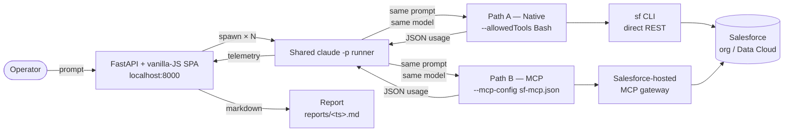
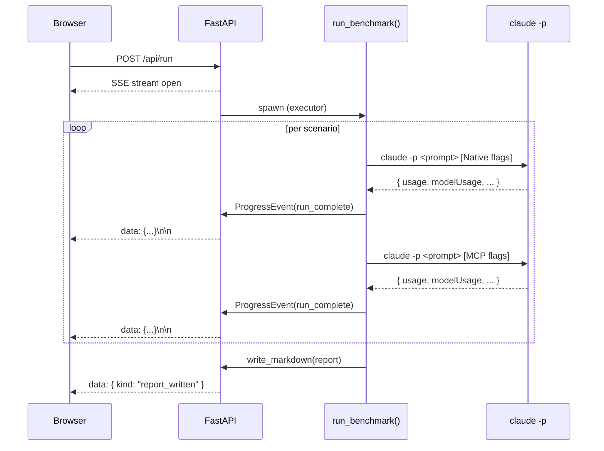

# Token Comparison Tool

> **Get started in 5 steps**
>
> **1.** Clone the repository
>
> ```bash
> git clone https://github.com/josers18/Token-Comparison-Tool.git
> cd Token-Comparison-Tool
> ```
>
> **2.** Make sure prerequisites are installed and authenticated
>
> ```bash
> python3 --version          # need 3.11+
> claude --version           # Claude Code installed
> claude auth status         # logged in
> sf org list                # Salesforce CLI authenticated to your org
> ```
>
> **3.** Configure your Salesforce External Client App credentials
>
> ```bash
> cp .env.example .env.local
> # open .env.local and fill in SF_CLIENT_ID and SF_CLIENT_SECRET
> # from your ECA (must have mcp_api, cdp_api, refresh_token scopes
> # and http://localhost:8000/callback as a callback URL)
> ```
>
> **4.** Launch the app
>
> ```bash
> ./run.sh
> ```
>
> **5.** Open <http://localhost:8000>, click **Connect Salesforce** to
> authorize via OAuth, then choose how to start:
>
> - **Run benchmark** at the top — runs the full scenario catalog
> - **Run free format** — write a custom prompt with your own model /
>   runs / max-turns settings
> - **Load report** — view a past benchmark in the same UI, either
>   from the dropdown of recent reports or by uploading an
>   `.md` / `.json` file

---

[](LICENSE)
[](https://www.python.org/downloads/)
[](https://fastapi.tiangolo.com/)
[](https://docs.pydantic.dev/)
[](#testing)
[](https://docs.claude.com/en/docs/claude-code)

A FastAPI + vanilla-JS web tool that benchmarks **token cost** between
two ways of invoking Salesforce operations from Claude:

- **Path A — Native:** Claude Code calls Salesforce APIs directly via the
  `sf` CLI. No MCP servers loaded.
- **Path B — MCP:** Claude Code calls the same operations through the
  Salesforce-hosted MCP servers (`salesforce_crm` and
  `data_cloud_queries`).

Both paths run the same prompt against the same model and the same org.
The only axis of variance is the tool provider.

---

## Screenshots

### Catalog

The benchmark catalog. Below it (not shown in this older screenshot)
you'll find two more cards: a **Free-format scenario** card with its
own model / runs / max-turns controls, and a **Load saved report**
card with a dropdown of recent reports + a file upload. The list
itself has a column header row with **ID / Scenario / Scope /
Difficulty** labels and a tri-state master checkbox to select or
deselect every scenario at once.


### Scenario detail

Per-scenario verdict bar, hero metrics, custom HTML/CSS comparison chart,
editorial "Why these numbers differ" prose, and a turn-by-turn token
trace. Includes Export PDF + Download report at the bottom.


### Summary deck

Executive headline, three stat cards, cost-at-scale extrapolation,
per-scenario cost bars, and an auto-generated framework grid for "When
Native wins / When MCP wins".


> **Tip:** the green dot + wordmark in the top-left is a **home
> button** — click it any time to return to the catalog without losing
> in-progress work or loaded report state.

---

## Architecture

The two paths share everything except how Claude is given tools.



### Live progress over Server-Sent Events



### Three ways to put data on the screen

| Path | Endpoint | When to use |
|---|---|---|
| Run the catalog | `POST /api/run` | Full comparison across every scenario in `scenarios/` (the default benchmark) |
| Run a one-off prompt | `POST /api/run/freeform` | Ad-hoc question — each freeform scenario gets its own tab in the stepper with an indigo dot to distinguish it from catalog scenarios |
| View a past benchmark | `GET /api/reports/{name}/data` or `POST /api/reports/load` | Reload a past report (server-side or upload a file). Hydrates the same in-memory state a live run produces, so the verdict / trace / summary views all work identically |

All three end up in the same `_current_run["result_data"]` shape, so
the trace, summary, and PDF export endpoints serve them
identically — no special-case rendering paths.

---

## Features

- **Six-scenario catalog** — Sales Cloud SOQL through multi-DMO Customer
  360 joins. New scenarios are zero-code: drop a YAML file in
  `scenarios/`. The catalog table has a header row with column titles
  and a tri-state select-all checkbox so you can run a subset without
  clicking through every row.
- **Free-format mode** — write your own prompt in a textarea, pick
  Runs / Model / Max turns independently of the catalog, and run it
  through both paths. Each freeform scenario gets its own indigo-dot
  tab in the stepper that you can navigate into mid-run.
- **Load saved reports** — view any past benchmark in the same nice
  interface, even without re-running. Pick from a dropdown of the
  10 most recent reports, or upload an `.md` / `.json` report file
  from another machine. Works without Salesforce credentials —
  read-only viewing.
- **Live progress** — Server-Sent Events stream every run as it
  completes; UI updates in place. Polling fallback for when SSE drops.
- **Editorial summary** — auto-generated executive headline ("Native
  cost ~34% less per task..."), three stat cards, cost-at-scale
  extrapolation, "When Native wins / When MCP wins" framework grid.
- **Verdict bar** — per-scenario "Native came in at $0.022, MCP at
  $0.033 — 1.5× cheaper" headline with a delta-tokens callout.
- **Turn-by-turn trace** — token totals, cache breakdown, tool calls,
  and assistant replies side-by-side per turn.
- **Export** — markdown report download or full PDF (catalog page +
  every scenario + summary).
- **OAuth 2.1 + PKCE** — built-in browser-based Salesforce login flow.
  Tokens cached at `.cache/sf-token.json` (gitignored, 0o600).

## Prerequisites

| Dependency | How to verify |
|---|---|
| Python 3.11+ | `python3 --version` |
| [Claude Code](https://docs.claude.com/en/docs/claude-code) | `claude --version` and `claude auth status` |
| [Salesforce CLI](https://developer.salesforce.com/tools/salesforcecli) | `sf org list` |
| Salesforce ECA with `mcp_api cdp_api refresh_token` scopes and `http://localhost:8000/callback` as a callback URL | See `.env.example` |

## Project layout

```
.
├── README.md                  ← you are here
├── LICENSE                    ← MIT
├── pyproject.toml             ← Python package + dev deps
├── run.sh                     ← venv setup + uvicorn launcher
├── .env.example               ← OAuth ECA template (copy to .env.local)
├── config/
│   ├── README.md
│   └── sf-mcp.json            ← MCP server config for Path B
├── scenarios/                 ← scenario YAML catalog
│   ├── s01_soql_top_accounts.yaml
│   ├── s02_unified_profile_lookup.yaml
│   ├── s03_trade_volume_breakdown.yaml
│   ├── s04_open_cases_by_priority.yaml
│   ├── s05_opportunity_pipeline_report.yaml
│   └── s06_customer_360_displaytech.yaml
├── src/token_compare/         ← backend
│   ├── api.py                 ← FastAPI app + SSE + endpoints
│   ├── benchmark.py           ← run_benchmark() orchestrator
│   ├── runner.py              ← shared claude -p invoker
│   ├── analysis.py            ← trace + executive summary
│   ├── report.py              ← markdown writer
│   ├── report_loader.py       ← reverse parser (.md / .json → BenchmarkResult)
│   ├── recommendations.py
│   ├── scenarios.py
│   ├── preflight.py
│   ├── mcp_config.py
│   ├── sf_auth.py             ← OAuth 2.1 + PKCE
│   └── models.py              ← Pydantic types
├── static/                    ← single-page app
│   ├── index.html             ← catalog + freeform + load-report cards
│   ├── styles.css             ← editorial light theme
│   ├── app.js                 ← SPA controller (no innerHTML)
│   └── chart.min.js           ← vendored Chart.js (legacy fallback)
├── docs/
│   ├── screenshots/           ← README images
│   └── superpowers/           ← original design spec + impl plan
├── reports/                   ← generated reports (.md + .json sidecars; gitignored)
└── tests/                     ← pytest suite (81 tests)
```

## Adding a scenario

Drop a YAML file in `scenarios/`. The runner picks it up automatically:

```yaml
id: s07_my_new_scenario
title: "Top 10 leads by lead score"
category: core-crm
difficulty: medium
prompt: |
  In Salesforce, list the top 10 Leads by LeadScore descending.
  Return Name, Company, and LeadScore.
expected_operations:
  - "Native: sf data query Lead"
  - "MCP: mcp__salesforce_crm__soqlQuery"
success_criteria:
  must_contain: ["LeadScore"]
notes: |
  Tests SOQL ORDER BY on a custom numeric field.
```

## How it works under the hood

1. **One runner, two flag sets.** `src/token_compare/runner.py` builds a
   `claude -p` command line. Path A passes `--allowedTools Bash`; Path B
   passes `--mcp-config config/sf-mcp.json --allowedTools "mcp__*"`.
   Same prompt, same model, same org, same `--max-turns` cap. Path order
   is randomized per scenario to neutralize first-mover effects.
2. **Telemetry comes from `claude -p --output-format json`.** Each run's
   stdout is a JSON array; the final `result` event has `modelUsage`
   (preferred) or `usage` (fallback) with input/output/cache tokens and
   `total_cost_usd`. The runner aggregates `modelUsage` across all
   turns, not just the last one.
3. **Robustness.** stdout is captured to a temp file (not a pipe — pipes
   truncate at ~192KB on macOS for large MCP metadata responses). The
   parser still extracts JSON even when `claude` exits non-zero (e.g.,
   `--max-turns` reached). Punt responses ("I apologize...") are flagged
   as failed even when `is_error=false`.
4. **Reports live in `reports/`.** Each completed benchmark writes both
   `benchmark-YYYY-MM-DD-HHMM.md` (human-readable) and a
   `benchmark-YYYY-MM-DD-HHMM.json` sidecar (clean reload format). Ten
   most recent are retained; pruning drops both files together. The
   full audit log of every `claude -p` invocation goes to
   `reports/commands.log` (also gitignored).
5. **Loading old reports.** The "Load saved report" card on the
   catalog reads from `reports/` server-side or accepts a file
   upload. JSON sidecars deserialize directly; older `.md`-only
   reports are reverse-parsed by walking the Appendix
   `<details>` blocks and feeding each embedded raw_json back through
   the same `parse_claude_json()` the live runner uses, recovering an
   identical `RunResult`. Path traversal is blocked at the API
   boundary — names must match `benchmark-*.md`.

## HTTP API reference

The frontend talks to these endpoints. They're also useful if you
want to script the tool from the command line.

| Method | Path | Purpose |
|---|---|---|
| `GET` | `/api/preflight` | Verify Claude Code, sf CLI, MCP config, and Salesforce OAuth are ready |
| `GET` | `/api/scenarios` | Return the scenario catalog (from `scenarios/*.yaml`) |
| `POST` | `/api/run` | Start a catalog benchmark; streams SSE events for live progress |
| `POST` | `/api/run/freeform` | Start a one-off benchmark with a custom prompt; streams SSE events |
| `GET` | `/api/run/status` | Polling fallback for SSE — current state + accumulated events |
| `GET` | `/api/reports` | List the 10 most recent reports on disk |
| `GET` | `/api/reports/latest` | Download the latest `.md` report (also handles `HEAD`) |
| `GET` | `/api/reports/latest/data` | Hydrate the latest run's `BenchmarkResult` JSON |
| `GET` | `/api/reports/latest/summary` | Auto-generated executive summary for the latest run |
| `GET` | `/api/reports/{name}/data` | Load a specific report by file name (path-traversal-safe) |
| `POST` | `/api/reports/load` | Multipart upload an `.md` or `.json` report and load it |
| `GET` | `/api/scenarios/{id}/trace` | Turn-by-turn trace + explanation paragraph for the most recently loaded benchmark's scenario |
| `POST` | `/api/sf/login` | Trigger the OAuth 2.1 + PKCE browser flow; blocks until callback |
| `POST` | `/api/sf/logout` | Clear the cached access token |
| `GET` | `/callback` | OAuth redirect URI handler |

## Testing

```bash
.venv/bin/python -m pytest tests/ -q
```

81 tests, ~0.3s. Coverage spans the runner (Bash + MCP shapes, JSON
parsing, punt detection, max-turns handling, OAuth callback flow), the
benchmark orchestrator, the report writer + reverse parser, the
recommendations generator, and the analysis layer.

## Security & privacy

- `.env.local` is gitignored. **Never commit your real `SF_CLIENT_ID` /
  `SF_CLIENT_SECRET`.**
- `.cache/sf-token.json` (the OAuth access token cache) is gitignored
  and stored with mode `0o600`.
- `reports/*.md`, `reports/*.json`, and `reports/commands.log` are
  all gitignored — they contain prompts, token counts, raw `claude -p`
  output, and possibly customer data from your org.
- The frontend never uses `innerHTML` with interpolated data. All DOM
  construction goes through `document.createElement` + `textContent` /
  attribute setters to avoid XSS even in trace output.

## Design spec

See [`docs/superpowers/specs/2026-05-04-token-comparison-tool-design.md`](docs/superpowers/specs/2026-05-04-token-comparison-tool-design.md)
for the original RFC. Implementation plan in
[`docs/superpowers/plans/2026-05-04-token-comparison-tool.md`](docs/superpowers/plans/2026-05-04-token-comparison-tool.md).

## License

[MIT](LICENSE)
